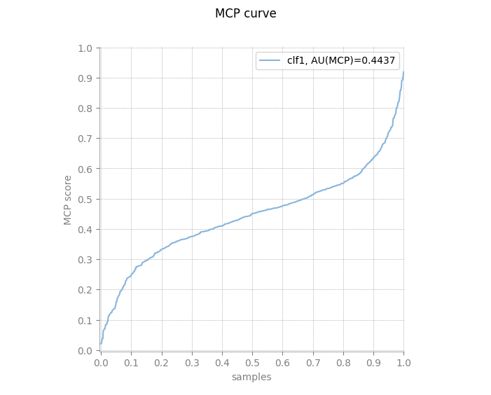

# Title

*Should be brief and explanatory* (0.25 points)

Why do buildings collapse? A predictive and descriptive analysis of earthquake damage

# Summary

*A paragraph summarizing the presented content* (0.5 points)

# Introduction

*Outline the general problem and where the data comes from* (0.5 points)

# Methodology

## Data

*Initial exploration of the data to understand the problem: preprocessing and visualization*

### Exploratory Analysis

The exploratory data analysis (EDA) phase was crucial for understanding the dataset, identifying patterns, and gaining insights into the predictive task. This phase involved examining the dataset's structure, distribution, and relationships between variables to inform subsequent preprocessing and modeling steps. The EDA process was divided into several key components:

#### 1. Data Overview

After loading the dataset, we conducted a preliminary examination to understand its structure and contents. The dataset consisted of 36 columns and 4000 rows, with each row representing a building's characteristics and damage grade. The target variable, `damage_grade`, was categorical and represented the severity of damage caused by an earthquake with an integer value in the range `[1,3]`. The dataset also contained several categorical and numerical features, each providing potentially valuable information for the predictive task.

#### 2. Data Consistency

Next step was to check the consistency of the data. We tried first to identify missing values and potential inconsistencies that could affect the quality of the predictive model. The dataset was found to be relatively clean, with no missing values in the columns.

#### 3. Data visualization

To gain deeper insights into the data, we decided to visualize the distribution of values for the different attributes available, as some of then, in particular the categorical were hard to interpret as their values were mostly given by single character. Such was the case of columns `position` or `surface_condition`.

We started by analyzing two features which represented percentages: `height_percentage` and `area_percentage`. These two appeared to be already normalized, as their values were in the range `[0,1]`. The distribution of these two features was visualized using boxplots, which showed that the majority of buildings had a height percentage of around 0.2 and an area of around 0.1. In terms of height there weren't many outliers, but in terms of area there were many buildings with values higher to that of the majority. However we decided to let those values as they were because it would make sense that in a city there would be buildings with a larger area than others. We did however infer that since the height of the buildings was mostly the same, that would mean that most buildings were either houses or small buildings.

Next we analyzed the other numerical features, which were `age`, `count_floors_pre_eq`, `count_families`. And as we suspected, most buildings were residential houses, as the majority, with a familiy or two at most, rarely more that that. We also found that most buildings were registered as being 0 years since construction, and there was also a spike at 30 years since construction, which could mean that wither there was a boom in construction 30 years ago, or that the data was not properly recorded.

When it comes to the categorical features, we found that there was a lot of redundant data, for example, `plan_configuration` or `legal_ownership_status` had a value distribution that was mostly the same, with one value being the majority, and the set of `secondary_use_X` also had a low value distribution, with most not having any secondary use, which does fit with our hypothesis of most buildings being residential houses. On the same line of categorical features we tried to extract any realtion or meaning behind `surface_condition` and `position`, but we couldn't find any, as the values were mostly single characters and thus not very explanatory and there did not seem to be much correlation at first sight.

#### 4. Data Correlation

We also conducted a linear correlation analysis to identify relationships between numerical features and the target variable, `damage_grade`, and found the following features presented the highest correlation values:
-   `age` (0.269): We can infer that the age of the building is a significant factor in the damage grade, which is expected as older buildings are more likely to be damaged.
-   `area_percentage` (-0.325): Larger area percentages are correlated with lower damage grades, which could mean that larger buildings might experience less relative damage.
-   `roof_type` (-0.324): We can infer that the roof type is a significant factor in the damage grade, which is expected as some roof types are more resistant to earthquakes.
-   `has_superstructure_mud_mortar_stone` (0.393), `has_superstructure_cement_mortar_brick` (-0.415), `has_superstructure_rc_non_engineered` (-0.221) and `has_superstructure_rc_engineered` (-0.259): We can infer that the superstructure material is a significant factor in the damage grade, which is expected as some materials are more resistant to earthquakes.

#### 5. Further Analysis

Before taking any conclusions on the state of the data, we decided to carry out an analysis using the `DataExplorer` library, which report can be found alongside this document. The report did not shed light on anything that we hadn't already seen, but it served to reassure that the exploratory analysis we had done was correct. Overall the data seemed to be quite consistent and clean, although containing close to no variation in some columns, which could be a problem for the predictive model. And within some of those columns we decided some were best to be removed or processed in an specific way to reduce data complexity and potentially improve the model.

#### 6. Proposed Preprocessing

After conducting the exploratory analysis, we proposed the following:

- Considering one hot encoding for the categorical features.
- Applying techniques to deal with the imbalanced data on the target class `damage_grade`.
- Removing seemingly redundant columns to reduce dimensionality and noise in the data.
- Potentially combining the `has_secondary_use` columns into a single column to simplify the data.

When it comes to removing columns, we propose a few that could removed if needed to reduce dimensionality or noise in the data, as we believe it wouldn't affect much the results. Taking in mind of course that building preliminary models to confirm this would be beneficial still:
- `building_id`
- `plan_configuration`
- `legal_ownership_status`
- `count_families`
- `has_secondary_use_use_police`
- `has_secondary_use_gov_office`
- `has_secondary_use_health_post`
- `has_secondary_use_industry`
- `has_secondary_use_institution`
- `has_secondary_use_school`
- `has_secondary_use_other`

### Preprocessing

We undertook a structured preprocessing phase to prepare the dataset for effective machine learning modeling. This phase focused on cleaning the data, addressing class imbalances, and formatting the dataset to optimize training and evaluation. Our process was divided into the following steps:

#### 1. Data Cleaning

We began by ensuring the dataset’s integrity and consistency. Following the insights gained during the EDA, we reduced the number of columns, getting rid of non-contributive features. The following steps were taken to clean the data:

-   **Column Unification:** We consolidated related columns under the `has_secondary_use` group into a single column. This approach addressed inconsistencies and centralized the information for easier interpretation.

-   **Column Elimination:** Based on our earlier analysis, we decided to eliminate columns such as `building_id`, `plan_configuration`, `legal_ownership_status`, `count_families`, `has_secondary_use_police`, `has_secondary_use_gov_office`, `has_secondary_use_health_post`, `has_secondary_use_industry`, `has_secondary_use_institution`, `has_secondary_use_school`, and `has_secondary_use_other`. By doing so, we reduced dimensionality and noise, leaving 26 columns in the dataset.

#### 2. Train-Test Split

To ensure a robust evaluation of our models, we split the dataset into training and testing subsets. We used a stratified approach to maintain the distribution of the target variable across both subsets. Using the `caret` library, we implemented this split to ensure a clear and reproducible methodology. We opted for an 80-20 split, with 80% of the data allocated for training and 20% for testing. This division allowed us to train the models on a substantial portion of the data while retaining a separate set for evaluation.

#### 3. One-Hot Encoding

We transformed categorical variables into numerical format using one-hot encoding. This step involved creating binary columns for categories within the features `land_surface_condition`, `foundation_type`, `roof_type`, `ground_floor_type`, `other_floor_type`, and `position`. While this increased the number of columns, it made the data compatible with machine learning algorithms. We saved the one-hot encoded dataset as `onehot` for future analysis.

#### 4. Correlation Analysis

To address multicollinearity, we performed a correlation analysis. We identified two pairs of highly correlated columns: `land_surface_condition_n` and `position_s`, and `land_surface_condition_t` and `position_t`. In each pair, we retained the column with the higher variance to preserve the most informative features. We named the resulting dataset `filtered_onehot` and saved it for further analysis.

#### 5. Principal Component Analysis (PCA)

Next, we applied PCA to reduce the dataset’s dimensionality. After standardizing the data to ensure consistent scaling, we used the Kaiser criterion to retain 13 principal components. These components captured significant variance while simplifying the dataset. Once PCA was completed, we reintroduced the target variable, `damage_grade`, and saved this version as `pca` for future steps.

#### 6. Handling Imbalanced Data

Addressing class imbalance in the target variable was a priority. We adopted two different techniques to improve the dataset’s balance:

-   **SMOTE (Synthetic Minority Oversampling Technique):** We generated synthetic samples for the minority class using SMOTE. By creating new instances based on the nearest neighbors, we enhanced the representation of the minority class, enabling the model to learn effectively from all classes. We carried out the implementation using the `smotefamily` package in R, ensuring practical applicability and reproducibility. This balanced dataset was saved as `smote`.

-   **Weight Allocation:** We applied another technique to mitigate the effects of class imbalance. We assigned weights to samples based on their class distribution. This method prioritized minority class instances during training, reducing prediction bias and improving overall performance. We saved this weighted dataset as `weighted` for subsequent analysis.

## Analysis I

*Tasks: supervised analysis, unsupervised analysis, comparison of results, etc.* (3 points)

### Supervised Analysis

The supervised analysis involved training and evaluating multiple machine learning models to predict the damage grade of buildings after an earthquake. We used the preprocessed datasets (`onehot`, `filtered_onehot`, `pca`, `smote`, and `weighted`) to compare the performance of various algorithms and preprocessing techniques.

Specifically, we decided to apply the following algorithms, available in the `caret` package:

-   **Random Forest (RF):** A robust ensemble learning method that combines multiple decision trees to improve predictive accuracy and generalization. Random Forest is well-suited for classification tasks and can handle high-dimensional data effectively. In particular, we used the ranger implementation of Random Forest, which offers enhanced performance.

-   **Gradient Boosting Machine (GBM):** An iterative ensemble method that builds decision trees sequentially, focusing on instances with higher prediction errors. GBM is known for its high predictive power and ability to capture complex relationships in the data.

-   **Stochastic Gradient Boosting (SGB):** A variant of Gradient Boosting that introduces randomness into the algorithm, improving generalization and reducing overfitting. SGB is particularly effective for large datasets and high-dimensional feature spaces.

It is important to note that we also applied hyperparameter tuning to optimize the models' performance. The `caret` package provided a convenient framework for tuning the algorithms and selecting the best hyperparameters through grid search and cross-validation. By tuning the models, we aimed to improve their predictive accuracy and generalization capabilities, ensuring robust performance on unseen data. As a result, we generated 15 different models from the combination of the three algorithms and five datasets.

Another key aspect of the supervised analysis was evaluating the models' performance using appropriate metrics. We focused on the following evaluation metrics to assess the models' effectiveness:

-   **Confusion Matrix:** As the target variable is categorical, we have focused on using this matrix and its metrics as it provides a lot of information about the model. In addition, we decided to use the extended version (`mode = "everything"`) that provides additional information such as the F1-Score, which is useful to us as it is the evaluation metric used in the ml-olympiad.

-   **Area Under the Curve (AUC):** This metric is particularly useful for binary classification problems, providing insights into the model's ability to distinguish between classes. A higher AUC-ROC score indicates better performance, with a value of 0.5 representing random guessing and 1 representing perfect classification. In our case, we saw that R allowed the use of a multi-class auc function and initially used it. However, after the follow-up class, we read the paper [@hand2001simple] in which the implementation is discussed and discovered that in 50% of the cases, the results provided are incorrect. Therefore, following the professor's recommendation, we made use of the Python library defined in *Classification performance assessment for imbalanced multiclass data* [@aguilar2024classification], as it obtained really good results compared to the previous one, and we implemented a python wrapper in R using the `reticulate` library to use this python library (`imcp`).

#### Implementation

To reduce the code duplication and improve the readability of the supervised training, we implemented 3 functions to train the models, generate the confusion matrix and calculate the AUC-ROC score given some information like the `algorithm`, the `tuning grid`, the `dataset`, the `location` to store the predictions, the `test` dataset, etc.

#### In-depth analysis selection

Since we obtained 15 models as a result of the training, we have decided to choose 6 in order to comment on the most interesting results. In choosing these models, we have relied on the models with the best precision, recall, F1-Score and AUC; resulting in:

-   **Best precision**: `rf_filtered` and `rf_weighted`

-   **Best recall**: `rf_weighted` and `gbm_pca`

-   **Best f1 (mean)**: `rf_onehot` and `gbm_smote`

-   **Best AUC**: `gbm_filtered` and `gbm_smote`

In the section [supervised analysis results](#supervised-analysis-2) we will analyse the results provided by the rf_onehot, rf_filtered, rf_weigthed, gbm_filtered, gbm_pca and gbm_smote models.

## Analysis II

*Results: tables and/or figures presenting the obtained results* (1.5 points)

### Supervised Analysis Results {#supervised-analysis-2}

In this section, we present the results of the supervised analysis, focusing on the performance of the machine learning models across different datasets and algorithms. We will present the six best models based on the metrics we have mentioned above: precision, recall, F1 Score, and AUC for multi-class.

#### Precision 

Precision measures the proportion of instances predicted as belonging to a particular class that actually belong to that class. We have calculated the precision for each class and the average precision for the selected models. The table below summarizes the precision scores for the selected models, and marks the best score for each class in bold:

| Class  | rf_onehot | rf_filtered | rf_weighted | gbm_filtered | gbm_pca  | gbm_smote |
|--------|-----------|-------------|-------------|--------------|----------|-----------|
| **1**  | 0.655     | **0.664**   | 0.503       | 0.617        | 0.000    | 0.574     |
| **2**  | 0.554     | 0.548       | **0.567**   | 0.549        | 0.518    | 0.551     |
| **3**  | 0.492     | **0.568**   | 0.434       | 0.453        | 0.070    | 0.454     |
| **Avg**| 0.568     | **0.594**   | 0.501       | 0.540        | 0.197    | 0.526     |

As we can see, the `rf_filtered` model performs best overall, achieving the highest average precision of 0.594. It shows strong performance across all three classes, particularly for class 1 (0.664) and class 3 (0.568), indicating that it effectively minimizes false positives in these categories. The `rf_onehot` model follows closely with an average precision of 0.568, also demonstrating consistent but slightly weaker performance. On the other hand, the `gbm_pca` model struggles significantly, with a precision of 0 for class 1 and only 0.070 for class 3, resulting in a very low average precision of 0.197. This suggests that `gbm_pca` fails to make reliable predictions for certain classes, which means it may not be suitable for this earthquake damage prediction task. Other models like `rf_weighted`, `gbm_filtered`, and `gbm_smote` achieve average results, but they do not stand out in terms of precision.

#### Recall

Recall measures the proportion of instances of a particular class that are correctly identified by the model. We have calculated the recall for each class and the average recall for the selected models. The table below summarizes the recall scores for the selected models, and marks the best score for each class in bold:

| Class  | rf_onehot | rf_filtered | rf_weighted | gbm_filtered | gbm_pca  | gbm_smote |
|--------|-----------|-------------|-------------|--------------|----------|-----------|
| **1**  | 0.548     | 0.526       | **0.719**   | 0.526        | 0.000    | 0.519     |
| **2**  | 0.760     | 0.879       | 0.295       | 0.671        | **0.884**| 0.584     |
| **3**  | 0.250     | 0.096       | **0.662**   | 0.331        | 0.019    | 0.435     |
| **Avg**| 0.519     | 0.500       | **0.558**   | 0.509        | 0.301    | 0.513     |

As we can infer from the table, `rf_weighted` model stands out with the highest average recall of 0.558. This indicates its strong ability to correctly identify instances across all classes, particularly for class 1 (0.719) and class 3 (0.662). However, it underperforms for class 2, where its recall is only 0.295, showing some inconsistency in recovering instances of this class. Meanwhile, `gbm_pca`, despite its poor precision, achieves the highest recall for class 2 (0.884), suggesting it is effective at capturing most true instances of this class but fails to generalize well to others, as evidenced by its near-zero recall for class 1. The `rf_filtered` model, although strong in precision, lags in recall with an average score of 0.500, particularly struggling with class 3 (0.096), where it fails to capture a significant proportion of true instances. Other models like `rf_onehot`, `gbm_filtered`, and `gbm_smote` achieve average scores, with no standout performance in terms of recall.

#### F1 Score

A higher F1-Score reflects a better balance between precision and recall, crucial for minimizing false positives and false negatives in critical applications. In the table below, we present the F1 scores of the selected models and the best performing model for each class marked in bold:

| Class   | rf_onehot | rf_filtered | rf_weighted | gbm_filtered | gbm_pca | gbm_smote |
|-----------|-----------|-----------|-----------|-----------|-----------|-----------|
| **1**   | **0.597** | 0.587       | 0.591       | 0.568        | NA      | 0.545     |
| **2**   | 0.641     | **0.675**   | 0.387       | 0.603        | 0.653   | 0.567     |
| **3**   | 0.332     | 0.164       | **0.423**   | 0.382        | 0.030   | 0.444     |
| **Avg** | **0.523** | 0.475       | 0.501       | 0.518        | 0.341   | 0.519     |

The comparison of F1-Scores highlights that the `rf_onehot` model performs best overall, achieving the highest average score of 0.523 and excelling in `Class 1`, though its performance for `Class 3` (0.332) is relatively weaker due to the fact that as we have seen in general terms `Class 3` is the most difficult to distinguish from `Class 2`. The `rf_filtered` model outperforms others for `Class 2` with an F1-Score of 0.675, while `rf_weighted` is most effective for `Class 3` at 0.423, showing the need to take into account the distribution of the classes of the dataset. On the other hand, models like `gbm_pca` struggle, with NA for `Class 1` due to zero precision and recall, indicating a complete failure to detect that class.

#### AUC

The AUC-ROC score provides insights into the models' ability to distinguish between classes, with higher scores indicating better performance. The table below presents the AUC-ROC scores for the selected models:

| Metric | rf_onehot | rf_filtered | rf_weighted | gbm_filtered | gbm_pca | gbm_smote |
|--------|-----------|-------------|-------------|--------------|---------|-----------|
| AUC multiclass | 0.436 | 0.432 | 0.423 | 0.443 | 0.342 | 0.444 |

The AUC-ROC scores show that the `gbm_smote` model performs best, with an AUC of 0.444, closely followed by `gbm_filtered` at 0.443. The `rf_onehot` model achieves an AUC of 0.436, indicating moderate performance in distinguishing between classes. The other models, such as `rf_filtered`, `rf_weighted`, and `gbm_pca`, exhibit similar AUC scores, ranging from 0.423 to 0.432. These results suggest that the models can differentiate between classes, with `gbm_smote` demonstrating the highest discriminatory power.

 
 

 

 

<b>Figure 1:</b> AUC-ROC Curve for the `gbm_smote` model. 

 

As shown in Figure 1, while the AUC is relatively close to 0.5, it suggests that our model has some discriminatory power, but it is not highly effective at separating the classes. The MCP curve rises steadily without sharp increases, indicating that our model's predictions are only moderately better than random guessing. This AUC score reflects the performance of the `gbm_smote` model as one of the best among the models we evaluated, though there is still room for improvement.

## Discussion

*Conclusions that can be drawn from the results* (1.5 points)

# Conclusions

*A brief paragraph that "dialogues" with the initial summary* (0.5 points)

# Outstanding tasks

*Deep dive into topics or techniques not covered in class (e.g., filters, wrappers, etc.)* (3 points)

## Kaiser Criterion

The Kaiser criterion is a widely used method for determining the number of principal components to retain during PCA. It suggests retaining components with eigenvalues greater than 1, as these components explain more variance than a single original variable. By selecting components with eigenvalues above this threshold, we can capture the most significant information in the data while reducing dimensionality. The Kaiser criterion is a valuable tool for balancing the trade-off between complexity and information retention in PCA, ensuring that the transformed dataset remains informative and interpretable.

# Bibliography

*References to the data and, if relevant, additional sources* (0.5 points)
